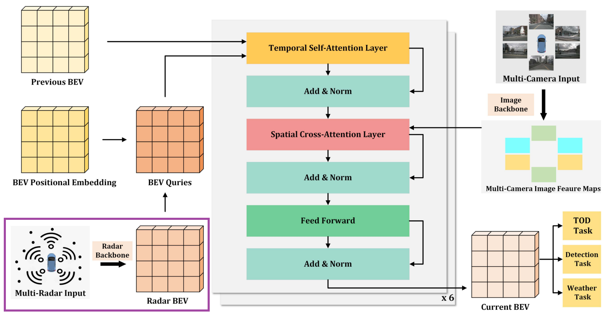
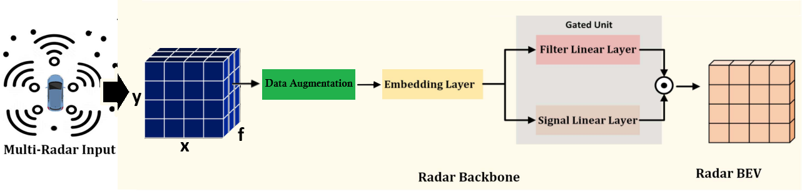

# Melhorando o desempenho da deteccão 3D de baixa visibilidade para veículos autônomos com fusão câmera-radar

<!-- PROJECT SHIELDS -->

[](https://github.com/PurdueDigitalTwin/REDFormer/blob/master/LICENSE)

<!-- PROJECT ILLUSTRATIONS -->

<br />
<div align="center">
    <p align="center">
        
    </p>
    <p align="center">
        
    </p>
</div>

______________________________________________________________________

## Sumário

  - [Sumário](#sumário)
  - [Resumo](#resumo)
  - [Instalação](#instalação)
    - [Preparação dos dados](#preparação-dos-dados)
      - [Download (nuscenes dataset)](#download-nuscenes-datasett)
      - [Generar anotações](#generar-anotações)
    - [Treinamento](#treinamento)
    - [Teste](#teste)
  - [Citação](#citação)
  - [Licença](#licença)
  - [Agradecimentos](#agradecimentos)

______________________________________________________________________

## Resumo

Com o surgimento de veículos autônomos, algumas tarefas como a detecção de objetos no ambiente têm se tornado cada vez mais necessárias, e a adoção ou rejeição da tecnologia depende da acurácia na localização e identificação de veículos e pedestres nas ruas. Considerando as condições atuais, em que motoristas humanos são capazes de reconhecer e estimar, de maneira eficiente, a distância entre esses obstáculos nas vias sob quaisquer condições de clima e iluminação, espera-se que, como requisitos de viabilidade para a adoção de veículos autônomos nas ruas, o veículo seja capaz de desempenhar a mesma função de forma igual ou superior, considerando a mesma precisão e tempo de execução da tarefa. Assim, neste trabalho é apresentada a modificação de uma arquitetura de detecção 3D de objetos utilizando fusão sensorial câmera-radar com o objetivo de reduzir o tempo de processamento, volume de dados e memória requerida pelo artigo base. Resultados demonstraram uma redução significativa no custo computacional mantendo as métricas no mesmo nível ao trabalho modificado.

______________________________________________________________________

### Instalação

Para facilitar a reprodutibilidade do projeto disponibilizamos um [Dockerfile](docker/Dockerfile), basta entrar na pasta e criar a imagem usando o comando abaixo colocando um nome para variável image-name desejado.

```
docker build . -t image-name
```

Após basta executar o arquivo [run](docker/run.sh). Lembrando que para isso é preciso ter instalado o docker engine localmente como em [Docker](https://docs.docker.com/engine/install/), bem como seu suporte para GPU em caso de disponibilidade de GPU através do guia [Nvidia-Toolkit](https://docs.nvidia.com/datacenter/cloud-native/container-toolkit/latest/install-guide.html).

### Preparação dos dados

#### Download (nuscenes dataset)

Para download do dataset siga as instruções oficiais do dataset, fazendo download dos componentes "v1.0 full dataset" e "CAN bus expansion" em [Nuscenes Website](https://www.nuscenes.org/download).

#### Generar anotações

É preciso realizar esse processo pois as anotações contem arquivos de caminhos, assim, após gerar essa etapa não mova os dados para outra localização, ou terá que refazer o processo.

```
bash scripts/create_data.sh
```

**Baixar os modelo pré-treinados**

Coloque o arquivo 'bevformer_raw.pth' em 'ckpts/raw_model' e coloque 'R101-DCN' na pasta 'ckpts'.

|   Backbone    |                                                       Download                                                       |
| :-----------: | :------------------------------------------------------------------------------------------------------------------: |
|   R101-DCN    | [download](https://github.com/cancui19/model_storage/releases/download/redformer/r101_dcn_fcos3d_pretrain.pth) |
| bevformer_raw |      [download](https://github.com/cancui19/model_storage/releases/download/redformer/bevformer_raw.pth)       |


**Estrutura das pastas**

```plain
REPO
├── ckpts        # pasta dos checkpoints
│   ├── raw_model/
│   │   └── bevformer_raw.pth
│   ├── r101_dcn_fcos3d_pretrain.pth
│   └── redformer.pth
├── data         # pasta dos dados (pode ser fora da pasta do projeto)
│   ├── nuscenes/
│   │   ├── full/
│   │   │   ├── can_bus/
│   │   │   ├── maps/
│   │   │   ├── samples/
│   │   │   ├── sweeps/
│   │   │   ├── v1.0-test/
│   │   │   ├── v1.0-trainval/
│   │   │   ├── nuscenes_infos_ext_train.pkl
│   │   │   ├── nuscenes_infos_ext_val.pkl
│   │   │   ├── nuscenes_infos_ext_rain_val.pkl
│   │   │   └── nuscenes_infos_ext_night_val.pkl
├── projects/
├── scripts/
├── tools/
├── LICENSE
├── README.md
├── scripts
├── setup.py
└── tools
```

### Treinamento

```
bash scripts/train.sh
```

### Teste

```
bash scripts/test.sh
```

Para mudar o ambiente de teste para noturno ou chuvoso basta ir [Aqui](projects/configs/redformer/redformer.py) (`projects/configs/redformer/redformer.py`) e modificar a variável `environment_test_subset`.

______________________________________________________________________

## Citação


```
Em breve 
```

______________________________________________________________________

## Licença

Distributed under the MIT License. See [`LICENSE`](LICENSE) for more information.

______________________________________________________________________

## Agradecimentos

Agradecimentos ao [LASI](http://www1.sel.eesc.usp.br/lasi/) (Laboratório de sistemas inteligentes) da USP São Carlos.

Este trabalho foi parcialmente financiado através do Instituto Nacional de Ciência e Tecnologia para Sistemas Autônomos Cooperativos (InSAC), CNPq (465755/2014-3 e 309532/2023-0), CAPES (Código de Financiamento 001), e Fundep - Rota 2030 (Linha V, Acordo 27192.02.04/2021.01-00, projeto 27192-54). 

Além disso, foram utilizadas como inspirações os seguintes trabalhos open source:

- [mmdetetection3d](https://github.com/open-mmlab/mmdetection3d)
- [BEVFormer](https://github.com/fundamentalvision/BEVFormer)
- [REDFormer](https://github.com/PurdueDigitalTwin/REDFormer)
